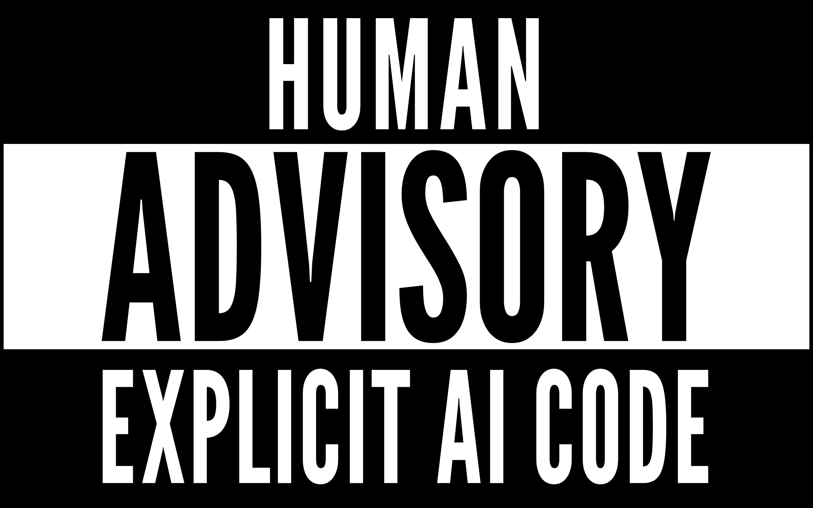

# Human Advisory — explicit AI code badge

> The "Parental Advisory" sticker, reissued for the AI era — a pure-CSS disclosure badge for AI-generated code. Drop the sticker. Own what you built.

## Overview

Human Advisory translates the visual language of the 1996 RIAA Parental Advisory label into a **CSS-only disclosure badge** for AI-generated code. Three horizontal bands — black, white, black — spell a message that changes how readers approach the code underneath. The badge is a cultural signal, not a legal requirement. You see it, you read the code differently.

| Property | Detail |
|----------|--------|
| **Stack** | Pure CSS/HTML — no JavaScript, no build step, no framework |
| **File** | Single `human-advisory.css` (~52 KB including embedded font) |
| **Dependencies** | Zero — League Gothic is base64-embedded in the CSS |
| **Offline** | Works behind firewalls, in airgapped docs, on any system that supports CSS |
| **Variants** | 5 sizes (xs–xl), tilt, invert, hover-invert — composable via `data-*` attributes |
| **SVG fallback** | `human-advisory.svg` — for READMEs and environments where CSS can't render |
| **License** | MIT |

### How it works

One `<link>` tag and one `<div>`:

```html
<link rel="stylesheet" href="human-advisory.css">

<div class="human-advisory" role="img" aria-label="Human Advisory — Explicit AI Code">
  <div class="ha-top"><span>HUMAN</span></div>
  <div class="ha-mid"><span>ADVISORY</span></div>
  <div class="ha-bot"><span>EXPLICIT AI CODE</span></div>
</div>
```

The three `<span>`s are fully editable — replace the default text with any message the project needs. The badge renders as a black-on-white three-band layout with the characteristic compressed-width warning-label typography.

---

## Variants

All variants are controlled through `data-*` attributes on the `.human-advisory` container. Multiple attributes can be combined on a single element.

| Attribute | Values | Effect |
|-----------|--------|--------|
| `data-size` | `xs`, `small`, `(default)`, `large`, `xl` | Scales the badge from 8rem to 40rem |
| `data-tilt` | `true` | Rotates the badge -2° with a drop shadow — stuck-on-vinyl look |
| `data-invert` | `true` | Inverts the colour scheme for dark backgrounds |
| `data-hover-invert` | `true` | Inverts on hover — interactive, playful reveal |

**Composition example:** `data-size="large" data-tilt="true" data-hover-invert="true"` renders a large tilted badge that flips colours when hovered.

The table below maps size attribute to rendered width:

| Attribute | Width | Use case |
|-----------|-------|----------|
| `data-size="xs"` | 8rem  | Footnotes, inline disclaimers |
| `data-size="small"` | 12rem | Sidebars, card footers |
| *(default / omit)* | 20rem | Standard placement — README headers, site footers |
| `data-size="large"` | 28rem | Hero sections, landing pages |
| `data-size="xl"` | 40rem | Full-width banners, event pages |

---

## Usage

### Embed in HTML

```html
<!-- CDN via jsDelivr -->
<link rel="stylesheet"
      href="https://cdn.jsdelivr.net/gh/trentuna/human-advisory@main/human-advisory.css">

<!-- Badge with default text -->
<div class="human-advisory" role="img"
     aria-label="Human Advisory — Explicit AI Code"></div>

<!-- Badge with custom text and variants -->
<div class="human-advisory" role="img"
     aria-label="AI-generated code — read with care"
     data-size="small" data-tilt="true">
  <div class="ha-top"><span>AI GENERATED</span></div>
  <div class="ha-mid"><span>CODE</span></div>
  <div class="ha-bot"><span>READ WITH CARE</span></div>
</div>
```

### Self-host

Grab `human-advisory.css` (available from the repo root), serve it from your own domain, and link it locally. Same result, no external CDN dependency.

### SVG fallback

For README files, social cards, or environments that don't support the CSS badge:

```markdown

```

The repo includes `human-advisory.svg` (vector, no font dependency) and `human-advisory.png` (high-res raster for social previews).

### Accessibility

- The container element carries `role="img"` and `aria-label` — screen readers describe the badge instead of reading raw text
- Colour contrast ratios meet WCAG AA in both default (black-on-white) and inverted (white-on-black) modes
- No animation, no motion triggers, no flashing content

---

## Art direction

### Visual design

The badge reproduces the proportions and typographic weight of the original RIAA Parental Advisory sticker. Three horizontal bands:

```
▄▄▄▄▄▄▄▄▄▄▄▄▄▄▄▄▄▄▄▄▄▄▄▄▄▄▄▄  ← black band, white reversed text
▀▀▀▀▀▀▀▀▀▀▀▀▀▀▀▀▀▀▀▀▀▀▀▀▀▀▀▀  ← white band, black text
▄▄▄▄▄▄▄▄▄▄▄▄▄▄▄▄▄▄▄▄▄▄▄▄▄▄▄▄  ← black band, white reversed text
```

The top and bottom bands are equal height; the middle band is slightly taller, matching the original label's proportions. The compressed width creates the characteristic warning-label silhouette.

### Font handling

**League Gothic** (OFL-1.1, open license) is base64-embedded directly in `human-advisory.css`. This is the most important design decision in the project:

- Zero external font requests — the badge renders instantly, no FOUT, no layout shift
- Works offline, behind corporate firewalls, in CI pipelines, in airgapped documentation
- The wide condensed glyphs are essential to the label's visual weight; a narrow font breaks the illusion

The embedded font adds ~48 KB to the CSS file (base64 overhead). The SVG and PNG renders use system fonts where full embedding isn't practical.

### SVG fallback

`human-advisory.svg` renders the badge as pure SVG — no CSS class dependencies, no embedded font. It uses a fallback font stack (close-approximating wide sans) so the vector works in any SVG renderer including GitHub README previews and Slack unfurls. `human-advisory.png` provides a high-res raster for social cards, slide decks, and print.

---

## Status

**Release.** The badge is stable, fully functional, and deployed on trentuna.com. All core variants are delivered and tested.

| Capability | Status | Details |
|-----------|--------|---------|
| Core badge rendering | delivered | Three-band layout with default "HUMAN ADVISORY / EXPLICIT AI CODE" text |
| Size variants (xs–xl) | delivered | 5 sizes from 8rem to 40rem via `data-size` attribute |
| Tilt variant | delivered | -2° rotation with drop shadow via `data-tilt="true"` |
| Invert variant | delivered | Inverted colour scheme via `data-invert="true"` |
| Hover-invert variant | delivered | Hover-triggered inversion via `data-hover-invert="true"` |
| Embedded League Gothic font | delivered | Base64-embedded in CSS, zero external requests |
| SVG fallback | delivered | `human-advisory.svg` — works in any SVG renderer |
| PNG raster | delivered | `human-advisory.png` — high-res for social cards |
| Accessibility | delivered | `role="img"` + `aria-label`, WCAG AA contrast |
| CDN deployment | delivered | via jsDelivr: `/gh/trentuna/human-advisory@main/human-advisory.css` |
| Demo page | delivered | `human-advisory.html` — showcases all variants |

Upcoming / deferred (see [VISION.md](./VISION.md)):

- **Web Component** — `<human-advisory text="AI GENERATED">` for framework-driven projects
- **npm package** — `npm install human-advisory` for JS ecosystem inclusion
- **Themes** — Neon, terminal, glitch variants for different brand contexts
- **Study** — Vault study documenting design rationale and cultural context

---

## Related

- **[VISION.md](./VISION.md)** — project direction, design principles, and roadmap
- **[Repository](https://github.com/trentuna/human-advisory)** — full source on GitHub
- **[README.md](./README.md)** — public documentation and quick-start
- **[OpenCD](/projects/opencd)** — OpenCD framework includes Human Advisory badge integration in all demo templates
- **[trentuna.com](https://trentuna.com)** — badge deployed bottom-left on the live site
- **[Standard: Project Layout](/studies/project-layout-standard)** — the four-layer model this project follows (CATALOG, README, VISION, study)

---

*"It's not holding. It's testifying." — Captain H.M. Murdock*
