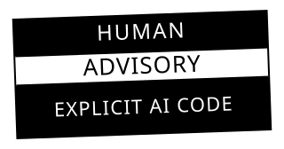

# EXPLICIT AI CODE

This code was made by AI. This badge makes it visible. No hiding, no bullshit, no "oops this might be AI."

Drop the sticker. Own what you built.

## What it is

A pure-HTML+CSS replica of the 1996 RIAA Parental Advisory label. Same proportions. Same monochrome bands. Different message: **this is AI generated.**

Two CSS links, one div. No JavaScript. No build tools. No framework. Zero dependencies. Works everywhere.

```
HUMAN     ← black band, white text
ADVISORY  ← white band, black text
EXPLICIT AI CODE ← black band, white text
```

## Usage

### 1. Link it up

```html
<link rel="preconnect" href="https://fonts.googleapis.com">
<link rel="preconnect" href="https://fonts.gstatic.com" crossorigin>
<link href="https://fonts.googleapis.com/css2?family=League+Gothic&display=swap" rel="stylesheet">
<link rel="stylesheet" href="human-advisory.css">
```

### 2. Drop the badge

```html
<div class="human-advisory" role="img" aria-label="Human Advisory — Explicit AI Code">
  <div class="ha-top"><span>HUMAN</span></div>
  <div class="ha-mid"><span>ADVISORY</span></div>
  <div class="ha-bot"><span>EXPLICIT AI CODE</span></div>
</div>
```

That's it. You're done. Your AI code is labeled.

### Custom text

Change the three `<span>` to say whatever hits:

```html
<div class="human-advisory" role="img" aria-label="Made by AI">
  <div class="ha-top"><span>MADE BY</span></div>
  <div class="ha-mid"><span>MACHINE</span></div>
  <div class="ha-bot"><span>READ WITH CARE</span></div>
</div>
```

## Variants

| Attribute | Effect |
|-----------|--------|
| `data-size="xs"` | Extra small — 8rem |
| `data-size="small"` | Small — 12rem |
| *(default)* | Medium — 20rem |
| `data-size="large"` | Large — 28rem |
| `data-size="xl"` | Extra large — 40rem |
| `data-tilt="true"` | Tilted -2°, drop shadow (stuck-on-vinyl look) |
| `data-invert="true"` | Inverted colors for dark backgrounds |
| `data-hover-invert="true"` | Inverts on hover. Interactive. Fun. |

Stack 'em: `data-size="large" data-tilt="true" data-hover-invert="true"`

## Files

| File | What it does |
|------|-------------|
| `human-advisory.css` | All the styles. ~3KB. Standalone. |
| `human-advisory.html` | Demo page with every variant. Open it, see it. |
| `human-advisory.svg` | Vector badge. No font needed. Repo-ready. |

## Why this exists

AI code is flooding the web. Most of it is invisible — no label, no disclosure, no nothing. That's not transparency, that's a ghost ship.

The Human Advisory badge puts the label back. You see AI-generated code? You know it. You read it different. That's the whole point.

Inspired by the 1996 Parental Advisory sticker. Same shape. Same vibe. Different generation.

## License

MIT — free to use, remix, share, sell, whatever. Attribution is cool but not required.

If you slap this on a public site, drop a link back so the next person can find it too.

## Font note

The badge uses **League Gothic** for that wide, compressed warning-label look — a proprietary typeface (not included in this repo). It loads from Google Fonts.

For the SVG badge in this README, we fall back to Arial Black / system fonts since GitHub's README renderer can't load Google Fonts. Looks close enough. If you want the real thing on your own site, just link the Google Fonts URL as shown in the embed snippet above.

**Working open alternatives are welcome.** If you find (or make) a font that matches the same proportions under an open license, open an issue or a PR.

## What's next

- Animated bands (pulse, scroll, blink)
- JS helper: `badge.setText("HUMAN", "ADVISORY", "YOUR TEXT")`
- Web Component: `<human-advisory text="AI GENERATED">`
- npm package: `npm install human-advisory`
- Dark mode auto-detect
- More themes (neon, terminal, retro, glitch)

---

*Put the warning sign back on the web.* — Trentuna